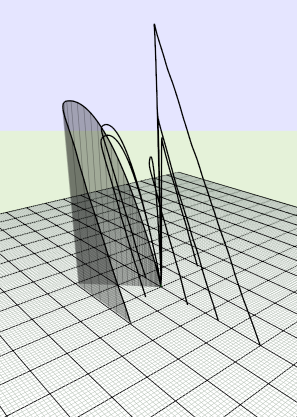

# Dispersion Tool 
## Using OpenRocket simulations

## Examples

The following examples have up to:

- 5% systematic component mass error.
- 5% random component mass error.
- 3&deg; variation in launch ride angle.
- 6&deg; error in launch rod direction.
- 1 in 5 chance of recovery failure.

### Simple Model Rocket, A Motor (Simulation #1)

### Simple Model Rocket, B Motor (Simulation #2)

##Screenshots

